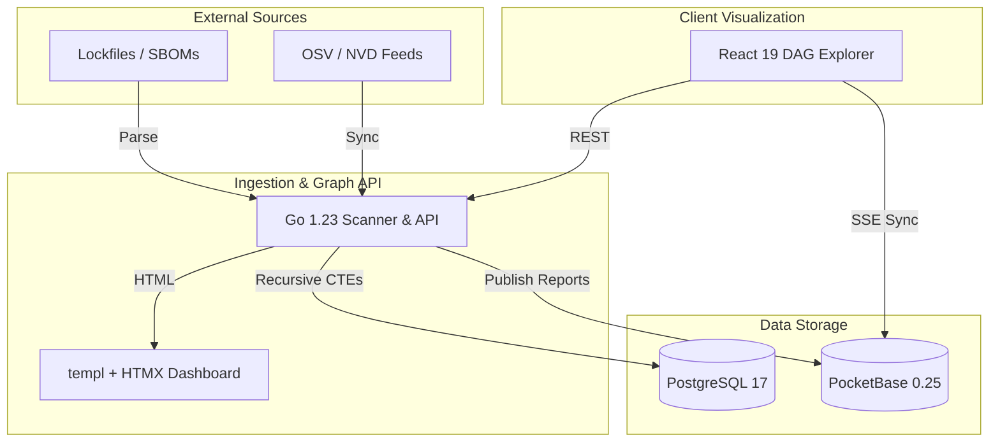

# 📡 tm3l-dep-radar

> **Point it at any repo. It tells you which dependencies are ticking time bombs.**

[](LICENSE)
[](go.mod)
[](explorer/package.json)

---

## 📖 Table of Contents
1. [Overview](#-overview)
2. [Architecture](#-architecture)
3. [Tech Stack](#-tech-stack)
4. [Getting Started](#-getting-started)
5. [Documentation](#-documentation)

---

## 🌟 Overview
Supply chain security scanner that ingests SBOMs (CycloneDX/SPDX), resolves dependency graphs, correlates against OSV/NVD vulnerabilities, and visualizes the exact transitive blast radius of any exploit.

## 📊 Architecture



## 🛠 Tech Stack
- **API & Ingestion**: Go 1.23
- **Admin UI**: `templ` + `HTMX`
- **Graph UI**: React 19 + TypeScript + Vite 6 + Canvas/SVG
- **Databases**: PostgreSQL 17 (Primary DAG Store) + PocketBase 0.25 (Edge/Real-time)

## 🚀 Getting Started
```bash
git clone https://github.com/tm3l/tm3l-dep-radar.git
cd tm3l-dep-radar
make docker-up
```
Visit `http://localhost:5174` to explore the dependency graphs.

## 📚 Documentation
See [`docs/architecture.md`](docs/architecture.md) for detailed internals.
