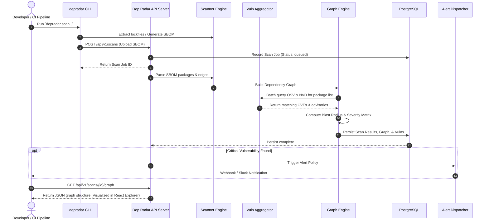

# 🏗️ Dep Radar Architecture & System Design

This document details the architectural principles, component decomposition, data models, and runtime data flows for **Dep Radar**, a high-performance software supply chain security scanner and dependency graph visualizer.

---

## 1. Architectural Principles

Dep Radar follows a **modular Go monolith** pattern with a clean separation of concerns:

1. **Single Binary Portability**: Both the scanner CLI and the central server are compiled into static Go binaries without external CGO or heavyweight runtime dependencies (e.g., no Python/Node runtimes required for the server core).
2. **Concurrent I/O Pipeline**: Vulnerability database ingestion (OSV, NVD, GHSA) and dependency resolution leverage Go goroutines and worker pools with rate-limiting and bounded backpressure.
3. **Graph-First Data Model**: Dependencies are modeled as directed acyclic graphs (DAGs) in memory and stored with relational integrity in PostgreSQL using recursive queries for blast-radius analysis.
4. **Zero-Friction Dual Interfaces**:
   - **templ + HTMX** delivers instantaneous, low-overhead server-rendered HTML for administration and configuration.
   - **React 19 Explorer** provides client-side, interactive graph exploration for visual dependency forensics.

---

## 2. System Architecture Diagram

```
+-----------------------------------------------------------------------------------+
|                                  CLIENT LAYER                                     |
|                                                                                   |
|  +--------------------+    +----------------------+    +-----------------------+  |
|  |   depradar CLI     |    |   HTMX Admin UI      |    |  React Graph Explorer |  |
|  |  (CI / Dev Term)   |    | (templ SSR Dashboard)|    |   (Canvas / WebGL)    |  |
|  +---------+----------+    +----------+-----------+    +-----------+-----------+  |
|            |                          |                            |              |
+------------|--------------------------|----------------------------|--------------+
             | REST / Submissions       | HTTP SSR                   | JSON Graph   |
             v                          v                            v              |
+-----------------------------------------------------------------------------------+
|                            DEP RADAR GO BACKEND SERVICE                           |
|                                                                                   |
|  +-----------------------------------------------------------------------------+  |
|  |                       HTTP Router & Middleware                              |  |
|  |          - Request Auth  - Rate Limiter  - OpenAPI Spec Validator           |  |
|  +-------------------------------------+---------------------------------------+  |
|                                        |                                          |
|  +-------------------------------------+---------------------------------------+  |
|  |                              Core Engines                                   |  |
|  |                                                                             |  |
|  |  +----------------------+  +---------------------+  +--------------------+  |  |
|  |  |   Scanner Engine     |  |   Vuln Aggregator   |  |   Graph Engine     |  |  |
|  |  | - CycloneDX / SPDX   |  | - OSV Client        |  | - DAG Construction |  |  |
|  |  | - Package Lockfiles  |  | - NVD 2.0 Client    |  | - Transitive Paths |  |  |
|  |  | - Direct Resolution  |  | - GitHub Advisory   |  | - Blast Radius     |  |  |
|  |  +----------+-----------+  +----------+----------+  +---------+----------+  |  |
|  +-------------|-------------------------|-----------------------|-------------+  |
|                |                         |                       |                |
|  +-------------v-------------------------v-----------------------v-------------+  |
|  |                        Storage & Dispatch Layer                             |  |
|  |  +----------------------------------+  +---------------------------------+  |  |
|  |  |        Store Repository          |  |        Alert Dispatcher         |  |  |
|  |  | (PostgreSQL Queries & Relational)|  | (Slack, Discord, Webhooks)      |  |  |
|  |  +-----------------+----------------+  +----------------+----------------+  |  |
|  +--------------------|------------------------------------|-------------------+  |
+-----------------------|------------------------------------|----------------------+
                        |                                    |
                        v                                    v
            +-----------------------+            +-----------------------+
            |  PostgreSQL Database  |            |   External Webhooks   |
            | (Scans, Graphs, CVEs) |            |  (Slack, PagerDuty)   |
            +-----------------------+            +-----------------------+
```

---

## 3. Core Subsystems

### 3.1 Scanner Engine (`internal/scanner`)
- **Parsers**: Native decoders for Software Bill of Materials formats:
  - CycloneDX v1.4 / v1.5 / v1.6 (JSON & XML)
  - SPDX v2.2 / v2.3 / v3.0 (JSON & Tag-Value)
- **Lockfile Resolvers**: Inspects direct and indirect dependencies across npm (`package-lock.json`, `pnpm-lock.yaml`, `yarn.lock`), Go (`go.sum`, `go.mod`), Rust (`Cargo.lock`), Python (`poetry.lock`, `requirements.txt`), and Java (`pom.xml`).

### 3.2 Vulnerability Aggregator (`internal/vuln`)
- Fetches and maintains local/cached vulnerability feeds from:
  - **OSV.dev**: Rapid batch querying by package ecosystem and version.
  - **NIST NVD**: National Vulnerability Database API 2.0 client for CVE enrichment, CVSS metrics, and EPSS scores.
  - **GitHub Security Advisories (GHSA)**: Curated advisory database via GraphQL/REST.
- Caches advisories in PostgreSQL to minimize egress traffic and latency during high-frequency CI scans.

### 3.3 Graph Engine (`internal/graph`)
- Constructs in-memory directed graphs `G = (V, E)` where vertices `V` represent distinct packages/versions and edges `E` represent dependency relationships.
- Calculates:
  - **Transitive Depth**: Shortest path from root application to vulnerable dependency.
  - **Blast Radius**: Set of all direct modules impacted when a transitive component has a critical severity rating.
  - **Remediation Paths**: Identifies minimum required version upgrade on the direct dependency to pull in fixed transitive packages.

### 3.4 Storage Layer (`internal/store`)
- PostgreSQL 16 schema with normalized relational tables:
  - `repositories`: Project metadata and source tracking.
  - `scans`: Historical records of scan runs, timestamps, and aggregate statistics.
  - `dependencies`: Individual packages and resolved version strings.
  - `graph_edges`: Directed edges representing parent-child dependency links.
  - `vulnerabilities`: Normalized CVE/GHSA definitions, CVSS scores, and remediation references.

### 3.5 Alerting Subsystem (`internal/alert`)
- Asynchronously evaluates scan results against user-configured alert policies (e.g. `CVSS >= 8.0` or `Exploit Known = true`).
- Dispatches formatted payloads to Webhook endpoints, Slack Incoming Webhooks, Discord, and SIEM feeds.

---

## 4. End-to-End Data Flow



---

## 5. Deployment Topology

- **Standalone Mode**: Single binary CLI execution in ephemeral CI/CD runners without network dependencies (direct OSV lookup).
- **Cluster/Server Mode**: Containerized Go binary deployed via Docker Compose or Kubernetes, connected to a managed PostgreSQL cluster.
